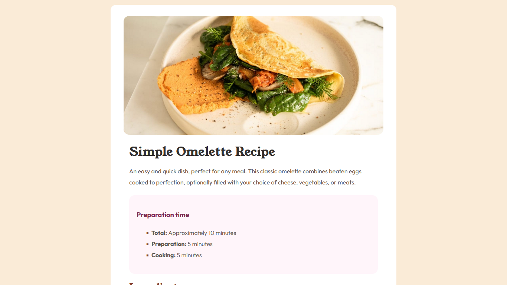

# Frontend Mentor - Recipe page solution

This is a solution to the [Recipe page challenge on Frontend Mentor](https://www.frontendmentor.io/challenges/recipe-page-KiTsR8QQKm). Frontend Mentor challenges help you improve your coding skills by building realistic projects. 

## Table of contents

- [Overview](#overview)
  - [The challenge](#the-challenge)
  - [Screenshot](#screenshot)
  - [Links](#links)
- [My process](#my-process)
  - [Built with](#built-with)
  - [What I learned](#what-i-learned)
  - [Continued development](#continued-development)
  - [Useful resources](#useful-resources)
- [Author](#author)
- [Acknowledgments](#acknowledgments)

**Note: Delete this note and update the table of contents based on what sections you keep.**

## Overview

### Screenshot


### Links

- Solution URL: [Add solution URL here](https://arize99.github.io/responsive-recipe-page-using-css-grid-and-flexbox/)

## My process

### Built with

- Semantic HTML5 markup
- CSS custom properties
- Flexbox
- CSS Grid
- For styles

### What I learned

I learned a lot of things working on this project.
<ul>
<li> Setting list items has never been more convenient.</li>
<li> Though there were strong deliberations on how to style a particular aspect. It pays to finally come to a conclusion on how best to do it.</li>
<li> I was pushed to learn how to space text items as I want by spanning text in-between and using the 

```css
.{
  display: inline-block
}
```
to give texts a desired border width.</li>
<li>I learned how to color and style ordered and unordered list items</li>
</ul>

### Continued development

I want to make this page responsive as soon as possible. I did not start with mobile responsive.

### Useful resources

- [W3Schools](https://www.w3schools.com) - This helped me with most of the CSS code supports.
- [Google](https://www.google.com) - This is amazing search engine that helped me remember most of the codes I forgot. I'd recommend it to anyone still learning coding. 😉

## Author

- Website - [Arize Nnonyelu](https://www.your-site.com)
- Frontend Mentor - [@arize99](https://www.frontendmentor.io/profile/arize99)
- Twitter - [@upgrade1010](https://www.twitter.com/upgrade1010)

## Acknowledgments

Thank you to the whole dev community, and thank you to everyone who puts out coding content both video and text out there. 💪🏽 This Kudos goes to you.

Thank you so much [Frontend Mentor](https://www.frontendmentor.io) 💖 for this challenge.
